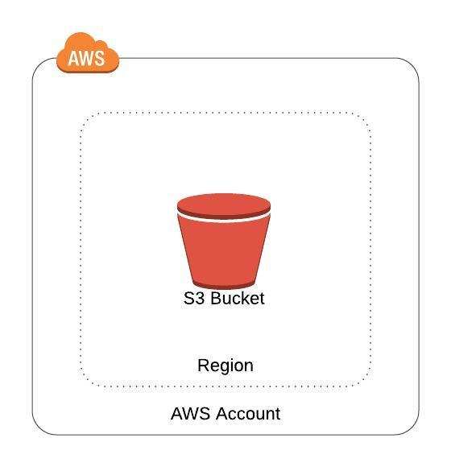

# AWS CloudFormation S3 Bucket Example Template

This template is used to create a CloudFormation Stack that implements a single S3 Bucket for basic object storage and access.



The following optional parameters implement the bucket's general configuration:
* **Encryption**: Allows for default encryption to be enabled for all objects stored in the bucket 
* **Versioning**: Allows for versioning to be enabled on all objects stored in the bucket
* **ACL**: Allows the ability to use valid canned access control lists for securing access to the S3 bucket 

If you decide to enable default encryption on the bucket, you have the additional option to supply a KMS Key Id to use in place of the default key via the KmsKeyId parameter.  If the KmsKeyId parameter is left at its default value of "12345678-aaaa-bbbb-cccc-123456789abc", all objects will be encrypted using the default Amazon S3-Managed keys (SSE-S3), instead of using a unique KMS Key (SSE-KMS).

Upon successful deployment, the template exports a bucket URL and the bucket ARN; both of which can be referenced and imported in subsequently deployed CloudFormation templates.


<br />

## Getting Started
---
At a minimum, access to an AWS Account and permissions to deploy all of the resources defined in the template from the CloudFormation console are required.  If you would like to deploy the template from the commandline a set of CLI credentials with the permissions to deploy all of the resources defined in the template and the installation and configuration of AWS CLI is required.

<br />

## Prerequisites
---
* Installing AWS CLI: https://docs.aws.amazon.com/cli/latest/userguide/cli-chap-install.html
* Configuring AWS CLI: https://docs.aws.amazon.com/cli/latest/userguide/cli-chap-configure.html

<br />

## Deploying via AWS CLI
---
Create a params.json file to store the template parameter values.

*Example*:
```
[
    "ACL=Private",
    "BucketName=jane-doe-test-bucket-1-1282019",
    "Encryption=true",
    "KmsKeyId=12345678-aaaa-bbbb-cccc-123456789abc",
    "Versioning=Suspended"
]
```

Create the tags.json file and populate with all necessary tags.

*Example*:
```
[
    "Business_Unit=1Strategy",
    "Owner=John Doe",
    "Project=Bastion Host"
]
```

Deploy the template to your account/environment:
```
aws cloudformation deploy \
    --template-file s3_bucket.yaml \
    --stack-name JohnDoeTestS3Bucket \
    --tags file://tags.json
    --region "us-east-1" \
    --parameter-overrides file://params.yaml
```

<br />

## Authors
---
* Will Nave - [1Strategy](https://www.1strategy.com)

<br />

## License
---
Copyright 2019 1Strategy

Licensed under the Apache License, Version 2.0 (the "License"); you may not use this file except in compliance with the License. You may obtain a copy of the License at

http://www.apache.org/licenses/LICENSE-2.0

Unless required by applicable law or agreed to in writing, software distributed under the License is distributed on an "AS IS" BASIS, WITHOUT WARRANTIES OR CONDITIONS OF ANY KIND, either express or implied. See the License for the specific language governing permissions and limitations under the License.

<br />

## References
---
* Amazon S3 Template Snippets: https://docs.aws.amazon.com/AWSCloudFormation/latest/UserGuide/quickref-s3.html
* Amazon S3 Bucket BucketEncryption: https://docs.aws.amazon.com/AWSCloudFormation/latest/UserGuide/aws-properties-s3-bucket-bucketencryption.html
* Access Control List (ACL) Overview: https://docs.aws.amazon.com/AmazonS3/latest/dev/acl-overview.html
* AWS S3 Developer's Guide: https://docs.aws.amazon.com/AmazonS3/latest/dev/Welcome.html
* Protecting Data Using Server-Side Encryption: https://docs.aws.amazon.com/AmazonS3/latest/dev/serv-side-encryption.html
* CloudFormation Best Practices: https://docs.aws.amazon.com/AWSCloudFormation/latest/UserGuide/best-practices.html